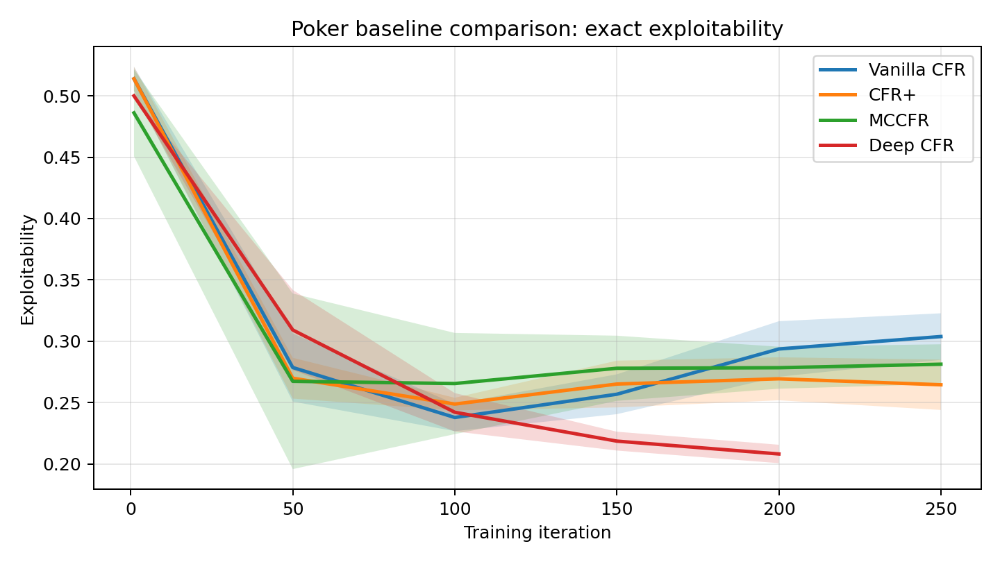
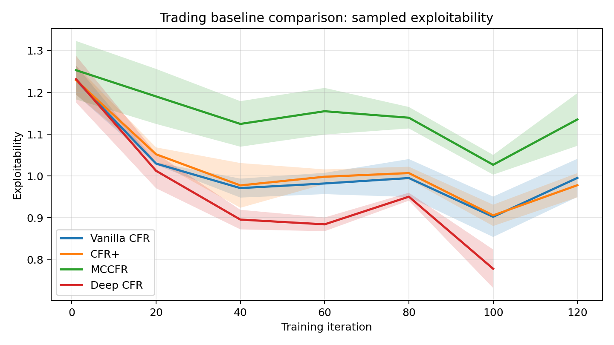
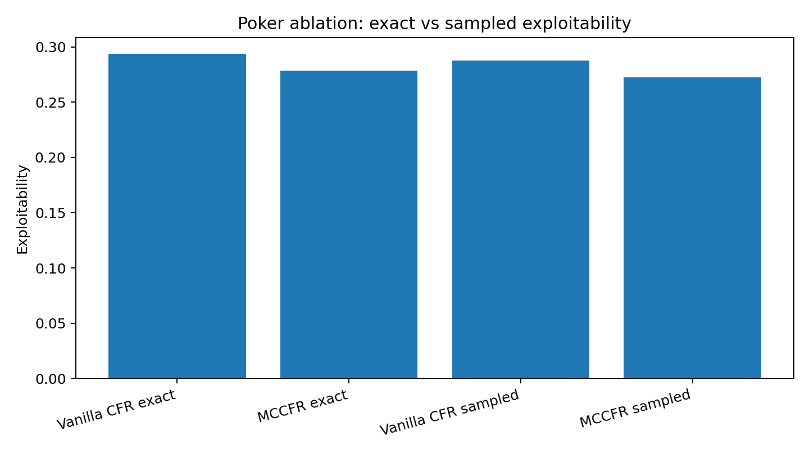
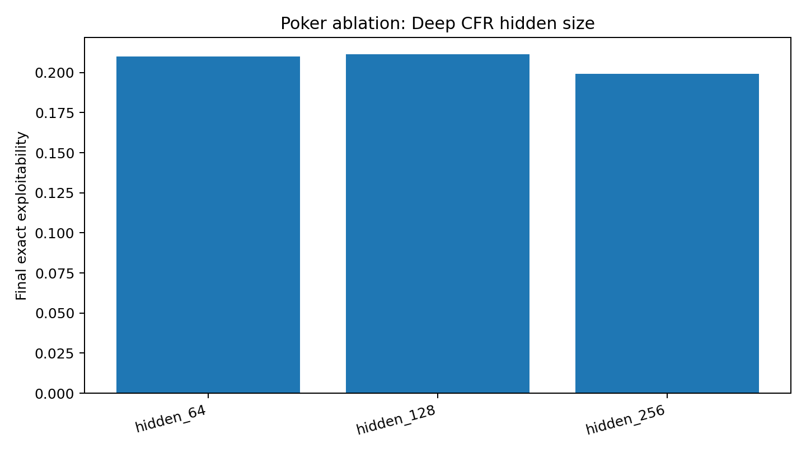
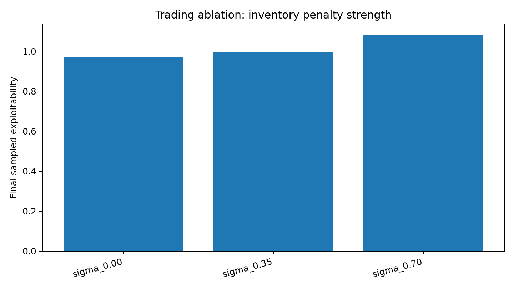
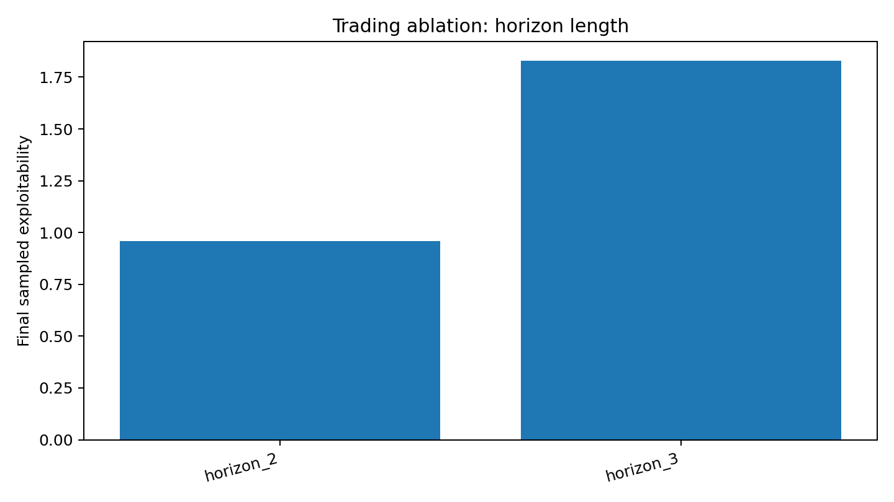

# Poker + CFR Trading Simulator

*An educational implementation of CFR, CFR+, external-sampling MCCFR, and Deep CFR for toy poker and market-making games*

| Topic | Summary |
| --- | --- |
| Algorithms | Vanilla CFR, CFR+, external-sampling MCCFR, Deep CFR |
| Game domains | Kuhn-style poker and a synthetic market-making game |
| Evaluation | Exact exploitability for poker; sampled exploitability for trading |
| Stack | Python, NumPy, PyTorch, Matplotlib, pytest |

## Overview

I built this repository to study regret-minimization algorithms in small imperfect-information games and to connect those ideas to a finance-flavored market-making simulation. My goal was not to build a production poker engine or a realistic trading system. Instead, I wanted a compact project that I could understand end-to-end, evaluate carefully, and extend in a way that felt technically honest.

This version of the project is more than a cleaned-up implementation. I treat it as a small experiment report. I added exact poker evaluation, a Monte Carlo CFR baseline, multi-seed comparisons, and ablation studies so that the conclusions are tied to measured behavior rather than intuition alone.

## What This Repository Is For

I use this codebase for three things:

1. Learning the mechanics of extensive-form regret minimization at a scale I can inspect directly.
2. Comparing tabular, sampled, and neural variants under a shared evaluation pipeline.
3. Presenting the work as an honest educational implementation with measured results and explicit limitations.

## Implemented Methods

### Vanilla CFR

I implement standard tabular Counterfactual Regret Minimization with cumulative regrets and average-strategy accumulation over infosets [1].

### CFR+

I include a simple CFR+ variant by clipping cumulative regrets at zero after each update. I use it here as a practical tabular baseline rather than a heavily tuned reproduction of the full CFR+ literature [2].

### External-Sampling MCCFR

I added an external-sampling Monte Carlo CFR baseline following the sampling idea in Lanctot et al. [3]. At traverser nodes I expand all actions to update regrets; at opponent nodes I sample a single action from the current strategy. In this repository, that gives me a literature-grounded sampled baseline that fits naturally into the existing game interface.

### Deep CFR

I implement a lightweight Deep CFR-style trainer inspired by Brown et al. [4]. I use fixed-length encodings, store sampled regret targets from traversals, and train a feedforward network with mean squared error. I intentionally keep this version modest: I do not claim a faithful reproduction of PokerRL-scale Deep CFR or Single Deep CFR [5].

## Games

### PokerGame

`PokerGame` is a Kuhn-style poker environment with:

- three private cards: `J`, `Q`, `K`,
- actions `check`, `bet`, `call`, and `fold`,
- exact root-state enumeration over all 6 ordered private-card deals,
- exact exploitability evaluation by best response on the full chance space.

I kept the poker game deliberately small because it lets me reason about exploitability exactly. That makes it a useful sanity check for whether the algorithms are behaving as expected.

### MarketMakingGame

`MarketMakingGame` is a toy sequential quoting game in which each player chooses among:

- `narrow`,
- `wide`,
- `skewbid`,
- `skewask`.

I generate synthetic market scenarios from short price paths and latent order-flow pressure. Utility combines:

- spread capture,
- fill probabilities that depend on quote aggressiveness and market pressure,
- mark-to-market P&L,
- an inventory penalty of `sigma * sqrt(abs(position))`.

I do not present this environment as realistic market microstructure. I use it as a compact sequential decision problem that lets me connect game-theoretic learning to a trading-motivated objective.

## Mathematical Analysis

The core update in CFR-style methods is regret accumulation at each infoset `I`. For player `i` and action `a`, I track cumulative regret

```text
R_t(I, a) = R_{t-1}(I, a) + v_i(sigma_{I->a}, I) - v_i(sigma, I)
```

where `v_i(sigma, I)` is the counterfactual value of the current strategy and `v_i(sigma_{I->a}, I)` is the value if I force action `a` at infoset `I`.

I convert regrets to a strategy by regret matching:

```text
sigma_t(I, a) = R_t^+(I, a) / sum_a' R_t^+(I, a')
```

where `R_t^+(I, a) = max(R_t(I, a), 0)`. If all positive regrets are zero, I fall back to a uniform distribution.

The average strategy is the object I actually evaluate:

```text
bar{sigma}^T(I, a) =
  sum_{t=1}^T w_t(I) * sigma_t(I, a) / sum_{t=1}^T w_t(I)
```

where `w_t(I)` is the reach-weight contribution for the infoset. In plain language, the algorithm can explore unstable intermediate policies, but the average strategy is what should approach equilibrium.

For evaluation, I use exploitability:

```text
exploitability(sigma) = BR_0(sigma_1) + BR_1(sigma_0)
```

in the zero-sum setting. Lower exploitability means the joint strategy is harder to exploit with a unilateral deviation.

Two implementation details matter here:

1. Poker exploitability is exact because I enumerate every root card deal and compute best responses over the full chance space.
2. Trading exploitability is sampled because the environment depends on generated market scenarios rather than a tiny closed-form chance tree.

That distinction is important. I treat the poker numbers as stronger evidence and the trading numbers as controlled but noisier estimates.

## Relationship To Prior Work

This repository is inspired by the classic CFR literature and by educational codebases such as `pyCFR`, but it is intentionally much smaller in scope. Relative to prior work, I would describe the project as follows:

- It follows the standard regret-minimization setup of Zinkevich et al. [1].
- It includes a simple CFR+ style regret-clipping baseline rather than a fully optimized large-scale CFR+ implementation [2].
- It now includes a genuine Monte Carlo CFR baseline through external sampling, which is the main new literature-facing extension in this revision [3].
- Its Deep CFR component is inspired by Brown et al. [4], but I keep it lightweight and educational rather than claiming a reproduction of PokerRL or SD-CFR-level experiments [5].

The most important point is that my comparisons are internal comparisons under one shared codebase, not claims that I reproduced the exact results of large published systems. I think that framing is more accurate and more useful.

## Reproducing The Results

### Local setup

```bash
python -m venv .venv
source .venv/bin/activate
pip install -r requirements.txt
```

### Main benchmark snapshots

```bash
.venv/bin/python run_poker.py
.venv/bin/python run_trading.py
```

### Full analysis sweep

```bash
.venv/bin/python analysis_runner.py
```

That script regenerates:

- baseline comparison JSON,
- multi-seed baseline plots,
- ablation plots,
- and the aggregate summary at `results/analysis_summary.json`.

### Tests

```bash
.venv/bin/python -m pytest -q
```

### Notebook demo

```bash
jupyter notebook notebooks/project_demo.ipynb
```

The notebook is set up to load saved artifacts first, so it works as a quick presentation demo even if I do not want to rerun the full experiments live.

## Baseline Results

The tables below come from `results/analysis_summary.json` using seeds `0, 1, 2`.

### Poker baseline comparison

Configuration:

- Vanilla CFR, CFR+, MCCFR: `250` iterations, evaluation every `50`
- Deep CFR: `200` iterations, evaluation every `50`
- evaluation: exact exploitability over all root deals

| Method | Final exact exploitability (mean +/- std) | Self-play value for player 0 (mean +/- std) |
| --- | --- | --- |
| Vanilla CFR | `0.3038 +/- 0.0190` | `-0.0544 +/- 0.0105` |
| CFR+ | `0.2645 +/- 0.0205` | `-0.0592 +/- 0.0059` |
| MCCFR | `0.2813 +/- 0.0162` | `-0.0612 +/- 0.0112` |
| Deep CFR | `0.2081 +/- 0.0075` | `-0.0171 +/- 0.0167` |

My reading of these poker results is:

- Deep CFR is the strongest method in this small benchmark under the current compute budget.
- CFR+ improves on vanilla CFR, but it still trails Deep CFR in both exploitability and stability.
- MCCFR is competitive with the tabular baselines and gives me a more literature-grounded sampled baseline without surpassing the neural approximation here.



### Trading baseline comparison

Configuration:

- Vanilla CFR, CFR+, MCCFR: `120` iterations, evaluation every `20`
- Deep CFR: `100` iterations, evaluation every `20`
- evaluation: sampled exploitability over synthetic market scenarios

| Method | Final sampled exploitability (mean +/- std) |
| --- | --- |
| Vanilla CFR | `0.9956 +/- 0.0457` |
| CFR+ | `0.9781 +/- 0.0290` |
| MCCFR | `1.1354 +/- 0.0631` |
| Deep CFR | `0.7782 +/- 0.0460` |

My interpretation is more cautious here:

- Deep CFR again performs best under the current budgets.
- CFR+ is slightly better than vanilla CFR.
- MCCFR is noticeably weaker in this stochastic toy trading environment, which suggests that the added sampling variance hurts more here than it does in tiny poker.
- Absolute exploitability remains fairly high because this environment is noisier, sampled, and intentionally simplified.



## Ablation Study

I added four ablations to understand whether the main conclusions are robust and to make the project read more like an experiment than a demo.

### 1. Exact vs sampled poker evaluation

For both vanilla CFR and MCCFR, sampled exploitability tracks the exact exploitability fairly closely:

- Vanilla CFR: exact `0.2937`, sampled `0.2875 +/- 0.0166`
- MCCFR: exact `0.2784`, sampled `0.2723 +/- 0.0331`

That is reassuring because it suggests that in this tiny poker game, moderate Monte Carlo evaluation is already a decent proxy for the exact metric. I still prefer the exact number whenever I can compute it.



### 2. Deep CFR hidden size on poker

I compared hidden sizes `64`, `128`, and `256`:

- `64`: `0.2100 +/- 0.0046`
- `128`: `0.2112 +/- 0.0071`
- `256`: `0.1993 +/- 0.0041`

The main takeaway is that larger capacity helps a bit, but not dramatically. In this toy setting, the gap between `64` and `256` is real but modest, which is consistent with the game being small enough that architecture is not the primary bottleneck.



### 3. Inventory penalty strength in trading

I varied the inventory penalty coefficient `sigma`:

- `sigma = 0.00`: `0.9681 +/- 0.0438`
- `sigma = 0.35`: `0.9956 +/- 0.0457`
- `sigma = 0.70`: `1.0816 +/- 0.0145`

Stronger inventory penalties make the problem harder in this setup. That makes sense: once inventory aversion becomes dominant, the agent has less room to exploit spread capture and short-term flow imbalances.



### 4. Trading horizon length

I compared horizon `2` against horizon `3`:

- horizon `2`: `0.8859 +/- 0.0588`
- horizon `3`: `1.7918 +/- 0.0705`

This was the sharpest ablation in the project. Even one extra decision step makes the toy trading problem much harder under the same rough compute budget. I think that result is useful because it shows why scaling the trading side should be treated carefully.



## Main Takeaways

If I had to summarize the current state of the project in a few lines, I would say:

- exact poker evaluation materially improved the credibility of the results,
- MCCFR was worth adding because it gives me a proper sampled literature baseline,
- Deep CFR is strongest in both domains under the current small-budget experiments,
- and the trading environment is much more sensitive to modeling choices and horizon length than the poker benchmark.

That mix of findings is exactly what I wanted from the project: not a claim of state-of-the-art performance, but a small codebase that supports nontrivial analysis.

## Saved Artifacts

The main generated files are:

- `results/poker_summary.json`
- `results/trading_summary.json`
- `results/analysis_summary.json`
- `results/analysis_poker_baselines.png`
- `results/analysis_trading_baselines.png`
- `results/ablation_poker_exact_vs_sampled.png`
- `results/ablation_poker_hidden_size.png`
- `results/ablation_trading_sigma.png`
- `results/ablation_trading_horizon.png`

## Repository Structure

- `abstract_game.py`: shared CFR training and evaluation logic
- `poker_cfr.py`: poker environment and exact root enumeration
- `trading_sim.py`: synthetic market-making environment
- `mccfr.py`: external-sampling Monte Carlo CFR trainer
- `deep_cfr.py`: lightweight Deep CFR trainer
- `evaluate.py`: exploitability, value, plotting, and summary helpers
- `run_poker.py`: poker benchmark entry point
- `run_trading.py`: trading benchmark entry point
- `analysis_runner.py`: baseline comparison and ablation sweep
- `notebooks/project_demo.ipynb`: interactive demo notebook
- `tests/`: unit tests for nodes, games, and MCCFR behavior

## Limitations

I think the project is strongest when I am explicit about what it does not do:

- I use Kuhn-style poker, not full Hold'em or a large Leduc implementation.
- I use a stylized synthetic trading game, not real market data or a calibrated order-book simulator.
- My Deep CFR implementation is educational and lightweight; it does not include every component used in larger published systems.
- The baseline comparisons are internal comparisons in one codebase, not claims of reproducing the exact numbers from the literature.
- The trading evaluation is sample-based and therefore noisier than the poker evaluation.

## References

[1] Zinkevich, M., Johanson, M., Bowling, M., & Piccione, C. (2008). *Regret minimization in games with incomplete information*. Advances in Neural Information Processing Systems.

[2] Tammelin, O. (2014). *Solving large imperfect information games using CFR+*. arXiv preprint arXiv:1407.5042.

[3] Lanctot, M., Waugh, K., Zinkevich, M., Bowling, M., & others. (2009). *Monte Carlo sampling for regret minimization in extensive games*. Advances in Neural Information Processing Systems.

[4] Brown, N., Lerer, A., Gross, S., & Sandholm, T. (2018). *Deep Counterfactual Regret Minimization*. arXiv preprint arXiv:1811.00164.

[5] Steinberger, E. (2019). *Single Deep Counterfactual Regret Minimization*. arXiv preprint arXiv:1901.07621.
