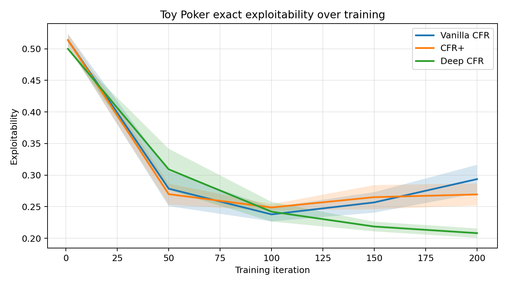
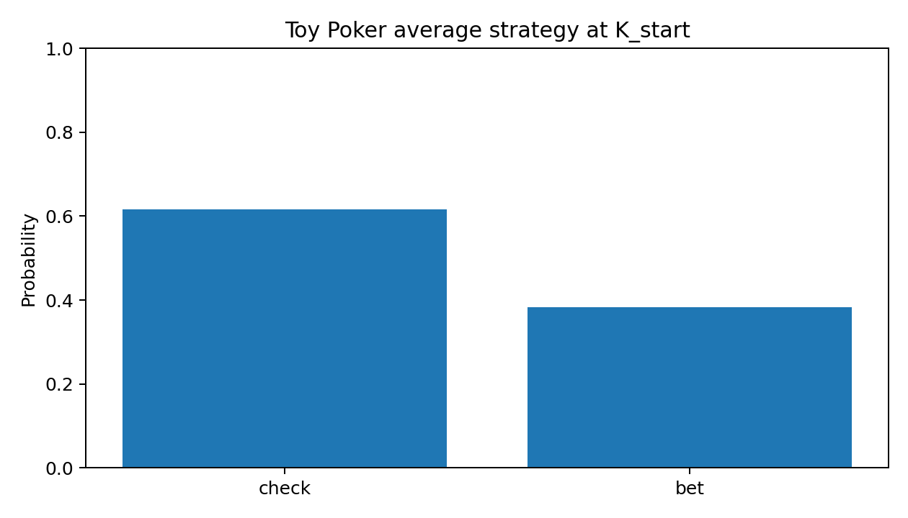
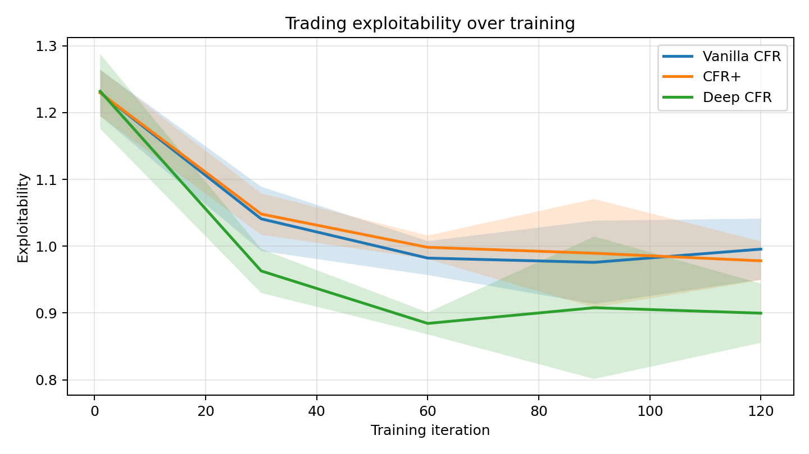
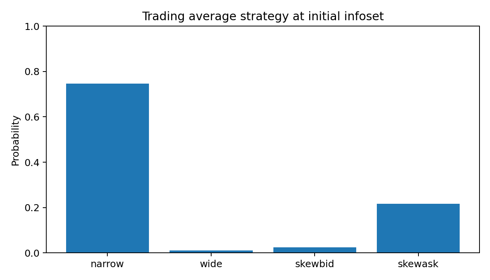

# Poker + CFR Trading Simulator

*An educational implementation of CFR, CFR+, and Deep CFR for toy poker and market-making games*

| Topic | Summary |
| --- | --- |
| Algorithms | Vanilla CFR, CFR+, Deep CFR |
| Game domains | Kuhn-style poker and a synthetic market-making game |
| Evaluation | Exact exploitability for poker; sampled exploitability for trading |
| Stack | Python, NumPy, PyTorch, Matplotlib, pytest |

## Overview

I built this repository to study Counterfactual Regret Minimization (CFR) in small imperfect-information games and to connect that framework to a simple market-making setting. My aim was not to claim production-level poker or trading realism. Instead, I wanted a compact codebase in which I could:

- fix a broken baseline,
- implement sound training and evaluation logic,
- compare tabular and neural regret-minimization variants,
- and present the results in a form that is transparent, reproducible, and easy to discuss.

I treat this project as a small experimental report as much as a software project. For that reason, I emphasize exact or clearly defined evaluation, saved result artifacts, and explicit limitations.

## What I Implemented

I refactored the original prototype into a shared game-theoretic training framework and added the following components:

- full two-player CFR traversals for each training iteration,
- explicit alternating-player recursion,
- shared game and evaluation logic in `AbstractGame`,
- vanilla CFR and CFR+,
- a lightweight Deep CFR approximation with fixed-length encodings and regret regression,
- exact root-state enumeration for poker,
- synthetic order-flow generation for trading,
- best-response and exploitability evaluation,
- multi-seed benchmarking, JSON summaries, and plot generation,
- regression tests, a demo notebook, and cleaner project documentation.

## Intended Use

I wrote this repository primarily for three use cases:

1. Learning: I wanted a codebase small enough to inspect end-to-end while still covering the main ideas behind CFR-style methods.
2. Experimentation: I wanted a baseline that I could extend with better evaluation, alternative training variants, or richer environments.
3. Presentation: I wanted a project that I could discuss in interviews as a concrete example of algorithmic debugging, modeling, and software organization.

## Implemented Methods

### Vanilla CFR

I use regret matching over tabular infosets, with cumulative regrets and average-strategy accumulation in the standard extensive-form setting [1].

### CFR+

I include a simple CFR+ style variant by clipping cumulative regrets at zero after each update. In this project, I use it as a practical baseline rather than a highly tuned implementation.

### Deep CFR

I implement a lightweight Deep CFR-style trainer inspired by Brown et al. [3] and Steinberger [4]. I use fixed-length one-hot state encodings, collect regret targets from traversals, and train a small feedforward network with mean squared error. I use this implementation for educational comparison rather than as a full-scale research reproduction.

## Games

### PokerGame

`PokerGame` is a Kuhn-style poker environment with:

- three private cards: `J`, `Q`, `K`,
- actions `check`, `bet`, `call`, and `fold`,
- hidden private information,
- exact root-state enumeration over all 6 ordered private-card deals,
- exact exploitability evaluation through best responses on the full chance space.

I intentionally kept the poker game small so that I could reason about the evaluation precisely and use it as a sanity check for the CFR logic.

### MarketMakingGame

`MarketMakingGame` is a toy sequential quoting game in which each player chooses among:

- `narrow`,
- `wide`,
- `skewbid`,
- `skewask`.

For this environment, I generate synthetic market scenarios using a latent order-flow process and short price paths. Utility depends on:

- fill probabilities that vary with quote aggressiveness and market pressure,
- quoted spread capture,
- mark-to-market P&L,
- and an inventory penalty of `sigma * sqrt(abs(position))`.

I do not present this environment as a realistic market simulator. I use it as a compact way to connect imperfect-information decision-making with a finance-flavored objective.

## Notes On Terminology

There are two details that matter when interpreting the figures:

1. I define one training iteration as a full sequential update for both players.
2. Poker exploitability is exact in this repository, but trading exploitability is estimated from sampled synthetic scenarios.

Those choices make the poker results more rigorous and the trading results more exploratory.

## Reproducing The Saved Snapshot Results

I saved the current benchmark artifacts directly in `results/`, including plots and JSON summaries.

### Local setup

```bash
python -m venv .venv
source .venv/bin/activate
pip install -r requirements.txt
```

### Reproduce the README snapshot

```bash
POKER_ITERATIONS=200 POKER_EVAL_EVERY=50 .venv/bin/python run_poker.py
TRADING_ITERATIONS=120 TRADING_EVAL_EVERY=30 TRADING_EVAL_EPISODES=120 TRADING_HORIZON=2 TRADING_SCENARIOS=128 .venv/bin/python run_trading.py
```

### Run larger default experiments

```bash
.venv/bin/python run_poker.py
.venv/bin/python run_trading.py
```

### Run tests

```bash
.venv/bin/python -m pytest -q
```

### Open the notebook

```bash
jupyter notebook notebooks/project_demo.ipynb
```

## Snapshot Configuration

The figures below come from the following saved configurations.

### Poker snapshot

- seeds: `0, 1, 2`
- iterations: `200`
- evaluation frequency: every `50` iterations
- evaluation mode: exact exploitability over all 6 root card deals

### Trading snapshot

- seeds: `0, 1, 2`
- iterations: `120`
- evaluation frequency: every `30` iterations
- horizon: `2`
- synthetic scenarios: `128`
- evaluation mode: sampled exploitability over synthetic market paths

I intentionally kept these budgets small enough to run comfortably on a laptop. If I wanted smoother curves, I would increase the iteration counts and evaluation budgets.

## Results

The main improvement in this revision is the evaluation story. In particular, I added exact root-state enumeration for poker, which lets me measure exploitability over the full chance space instead of relying only on Monte Carlo rollouts.

### Poker: exact exploitability over 6 card deals

| Method | Final exploitability (mean +/- std) | Self-play value for player 0 (mean +/- std) |
| --- | --- | --- |
| Vanilla CFR | `0.2937 +/- 0.0226` | `-0.0447 +/- 0.0056` |
| CFR+ | `0.2694 +/- 0.0175` | `-0.0600 +/- 0.0063` |
| Deep CFR | `0.2081 +/- 0.0075` | `-0.0171 +/- 0.0167` |

My interpretation is:

- Deep CFR reached the lowest exact exploitability in this snapshot.
- CFR+ improved on the plain tabular baseline, although it did not match Deep CFR here.
- Deep CFR also produced the self-play value closest to zero, which is the most stable result in this zero-sum setting.



For the representative vanilla-CFR strategy at `K_start`, I obtained:

- `check`: `0.6166`
- `bet`: `0.3834`



### Trading: sampled exploitability on synthetic market paths

| Method | Final exploitability (mean +/- std) | Self-play value for player 0 (mean +/- std) |
| --- | --- | --- |
| Vanilla CFR | `0.9956 +/- 0.0457` | `0.0088 +/- 0.0782` |
| CFR+ | `0.9781 +/- 0.0290` | `-0.0128 +/- 0.0765` |
| Deep CFR | `0.8998 +/- 0.0444` | `-0.0717 +/- 0.0480` |

My interpretation is:

- the trading environment is materially noisier and harder than the poker benchmark,
- all three methods improve from the initial random-policy regime,
- exploitability remains relatively high because the environment is still small, stochastic, and intentionally simplified,
- Deep CFR again performed best under the saved snapshot budget.



For the representative vanilla-CFR strategy at the initial trading infoset, I obtained:

- `narrow`: `0.7467`
- `wide`: `0.0106`
- `skewbid`: `0.0254`
- `skewask`: `0.2174`



## Saved Artifacts

I save the main experiment outputs to:

- `results/poker_summary.json`
- `results/trading_summary.json`
- `results/poker_exploitability.png`
- `results/poker_strategy.png`
- `results/trading_exploitability.png`
- `results/trading_strategy.png`

These files are what the notebook and the README use as their primary result snapshots.

## Repository Structure

- `abstract_game.py`: shared CFR training and evaluation logic
- `poker_cfr.py`: poker environment and exact root enumeration
- `trading_sim.py`: synthetic market-making environment
- `deep_cfr.py`: lightweight Deep CFR trainer
- `evaluate.py`: exploitability, value, plotting, and summary helpers
- `run_poker.py`: poker benchmark entry point
- `run_trading.py`: trading benchmark entry point
- `notebooks/project_demo.ipynb`: polished demo notebook
- `tests/`: unit tests for strategy nodes and game utilities

## Limitations

I kept this project intentionally modest, and I think it is important to be explicit about that:

- I use Kuhn-style poker rather than full Hold'em or full Leduc.
- I use a toy market-making environment rather than real limit-order-book data.
- My Deep CFR implementation is educational and lightweight; it does not include a separate average-strategy network.
- Trading exploitability is estimated from samples rather than computed exactly.
- I optimized for clarity and reproducibility rather than scale.

I view those constraints as a feature rather than a flaw: they keep the project honest and make the design choices easier to explain.

## Possible Extensions

If I continued this project, the next extensions I would consider are:

- adding a Monte Carlo CFR variant such as external-sampling MCCFR [2],
- extending poker beyond the current Kuhn-style setting,
- strengthening the trading environment with richer scenario generation and logging,
- adding more formal experiment management and sweep scripts,
- or introducing a separate average-strategy network for Deep CFR.

## Resume Framing

If I were summarizing this project in one line on a resume, I would write something close to:

> Implemented CFR, CFR+, and Deep CFR for toy poker and market-making simulations in Python; added exact exploitability evaluation for poker, synthetic trading scenarios, multi-seed benchmarking, and reproducible experiment reporting.

## References

[1] Zinkevich, M., Johanson, M., Bowling, M., & Piccione, C. (2008). *Regret minimization in games with incomplete information*. Advances in Neural Information Processing Systems.

[2] Lanctot, M., Waugh, K., Zinkevich, M., Bowling, M., & others. (2009). *Monte Carlo sampling for regret minimization in extensive games*. Advances in Neural Information Processing Systems.

[3] Brown, N., Lerer, A., Gross, S., & Sandholm, T. (2018). *Deep Counterfactual Regret Minimization*. arXiv preprint arXiv:1811.00164.

[4] Steinberger, E. (2019). *Single Deep Counterfactual Regret Minimization*. arXiv preprint arXiv:1901.07621.
